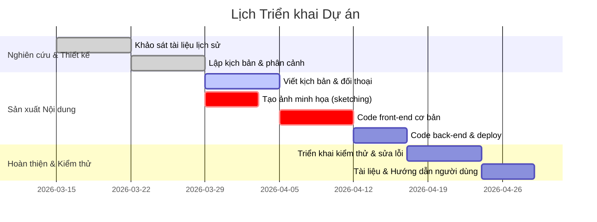

# Kế hoạch xây dựng Truyện tranh số tương tác về Chiến dịch Hồ Chí Minh 1975 dạy Triết học

## Tóm tắt hành động & Timeline  
Truyện tranh số tương tác sẽ đưa người chơi trải nghiệm chiến dịch Hồ Chí Minh 1975 gắn với các khái niệm triết học. Nội dung cần chuẩn bị tài liệu lịch sử và triết học chính xác (sử dụng nguồn Đảng, báo chí, bài giảng uy tín【32†L92-L100】), thiết kế nhân vật/chuỗi sự kiện song hành với nút lựa chọn phản ánh tư tưởng Mác-Lênin. Mỗi nhóm prompt hướng đến một mục tiêu: từ thu thập thông tin (gợi ý tìm kiếm) đến thiết kế cốt truyện, đối thoại, hình ảnh, giao diện, mã front-end/back-end, kiểm thử và tài liệu.  

Kế hoạch triển khai (dự kiến 8–10 tuần) minh họa dưới đây:



## 1) Nhóm prompt Nghiên cứu tài liệu  
- **Mục tiêu:** Tập hợp tài liệu lịch sử và triết học liên quan đến Chiến dịch Hồ Chí Minh 1975.  
- **Mô hình AI:** GPT-4 (text generation).  
- **Ví dụ nhập:** “Liệt kê 5 truy vấn tìm kiếm bằng tiếng Việt để thu thập tài liệu chính thống về Chuẩn bị Chiến dịch Hồ Chí Minh 1975, bao gồm nguồn Đảng, sách vở và báo chí【32†L92-L100】【27†L72-L79】.”  
- **Định dạng đầu ra:** JSON (danh sách các truy vấn). Ví dụ: `["Chiến dịch Hồ Chí Minh 1975 báo Quân đội Nhân dân", "Chuẩn bị chiến dịch 1975 tư liệu Đảng", ...]`.  
- **Tiêu chí nghiệm thu:**  
  - Các truy vấn phản ánh đúng chủ đề (lịch sử Việt Nam, năm 1975, triết học Mác-Lênin).  
  - Có gợi ý nguồn cụ thể (vd: Đảng bộ, Bách khoa Quân sự, báo *Nhân Dân*, *Quân Đội Nhân Dân*).  
  - Kết quả đầu ra là JSON hợp lệ.  

**Prompt mẫu:**  
```
"Tạo 5 truy vấn tìm kiếm tiếng Việt để thu thập tư liệu lịch sử Chuẩn bị Chiến dịch Hồ Chí Minh 1975 từ các nguồn chính thống như sách *Lịch sử Đảng*, Bách khoa quân sự, báo chí Đảng, báo Quân đội Nhân dân."
```  
【23†embed_image】 *Máy bay ném bom B-52 đầu tiên của Mỹ bị bắn rơi tại Hà Nội tháng 12/1972 – sự kiện đã tạo sức ép buộc Mỹ ký Hiệp định Paris 1973【24†L81-L84】【27†L72-L79】.* Trước tiên, AI cần định hướng bằng **từ khóa chính xác**. Ví dụ, các truy vấn mẫu có thể bao gồm:  
- “Chuẩn bị Chiến dịch Hồ Chí Minh 1975 Bách khoa Quân sự”  
- “Lịch sử Đảng Chiến dịch Hồ Chí Minh 1975”  
- “Hiệp định Paris 1973 và chiến trường miền Nam”  
- “Triết học Mác-Lênin trong chiến dịch Hồ Chí Minh”  
- “Báo Quân đội Nhân dân Chiến dịch Hồ Chí Minh 1975”  

## 2) Nhóm prompt Thiết kế cốt truyện  
- **Mục tiêu:** Xây dựng cấu trúc truyện: xác định nhân vật chính/phụ, chia chương và cảnh, gắn mỗi điểm quyết định với khái niệm triết học (ví dụ: **phép biện chứng duy vật**, **phép biện chứng lịch sử**, **đạo đức cách mạng**).  
- **Mô hình AI:** GPT-4 (text structuring).  
- **Ví dụ nhập:** “Tạo tiểu sử ngắn và động cơ hành động cho 4 nhân vật chính (2 cán bộ giải phóng, 2 sĩ quan ngụy Sài Gòn) trong truyện tương tác. Gắn mỗi nhân vật với một khái niệm triết học phù hợp.”  
- **Định dạng đầu ra:** Markdown hoặc JSON (cấu trúc phân cấp các chương, cảnh, nhân vật). Ví dụ:  
  ```json
  {
    "nhan_vat": [
      {"ten":"A","loi-ich":"...","khai-niem":"biện chứng duy vật"},
      ...
    ],
    "chuong": [
      {
        "ten":"Mùa Xuân Giải phóng",
        "cung":[
          {"ten":"Giải phóng Ban Mê","phuc-tap":"...", "lua-chon":[...]},
          ...
        ]
      },
      ...
    ]
  }
  ```  
- **Tiêu chí nghiệm thu:**  
  - Mô tả nhân vật rõ ràng, gắn đúng khái niệm triết học.  
  - Bố cục truyện có cấu trúc logic (dẫn nhập, cao trào, kết).  
  - Mỗi cảnh/nhánh có nút quyết định liên quan học thuật (VD: giải thích “phép biện chứng” qua tình huống cụ thể).  

**Prompt mẫu:**  
```
"Hãy phân tích cốt truyện: Đề xuất 3 chương chính của truyện tranh số về Chiến dịch Hồ Chí Minh 1975, cùng tên và tóm tắt ngắn gọn của mỗi chương. Trong mỗi chương, liệt kê các cảnh quan trọng và một nút lựa chọn (ví dụ 'tiếp tục tấn công' vs 'dừng nghỉ') đi kèm mục tiêu triết học cụ thể (ví dụ: áp dụng phép biện chứng như thế nào)."
```  

| Cảnh (Scene)                 | Lựa chọn (Choice)                         | Mục tiêu học (Learning Objective)        | Phản hồi (Feedback)                             |
|------------------------------|-------------------------------------------|-----------------------------------------|------------------------------------------------|
| 1. Chuẩn bị chiến dịch       | A1: Tập trung lực lượng; B1: Hoãn tiến công | Biện chứng duy vật (đánh giá thực tế)   | “Lựa chọn A giúp nắm vững thế trận【32†L92-L100】, phù hợp phép biện chứng.” |
|                              |                                           |                                         | “Lựa chọn B cho phép ta học hỏi thêm, song có thể bỏ lỡ cơ hội lịch sử.”   |
| 2. Đặt máy bay ném bom TSN    | A2: Ném bom chính xác; B2: Bỏ qua            | Duy vật lịch sử (tác động lực lượng)    | “A2 thể hiện mối quan hệ vật chất-khách quan rõ ràng.”                     |
| 3. Đấu tranh chính trị Sài Gòn| A3: Hòa đàm; B3: Giữ vững chiến đấu          | Đạo đức cách mạng (uy tín, quyết tâm)    | “Chọn A3 giảm xung đột nhưng mất tinh thần chiến đấu.”                     |
| ...                          |                                           |                                         |                                                |

Các cảnh và lựa chọn cần khớp với diễn biến lịch sử: ví dụ, cảnh Trảng Bom (28/4) đã ghi chiến công liên tục【32†L98-L100】. Trong ví dụ trên, lời giải thích phản hồi khuyến khích người chơi liên hệ chọn lựa của mình với nguyên lý triết học tương ứng.  

## 3) Nhóm prompt Viết đối thoại và bài giảng ngắn  
- **Mục tiêu:** Tạo nội dung truyện (hồi thoại, mô tả, hướng dẫn triết học). Chỉ dẫn rõ về giọng điệu (sử thi, nghiêm túc, ngắn gọn), độ dài (50–100 chữ mỗi bài giảng ngắn), và cách chèn trích dẫn (dạng `[nguồn]`).  
- **Mô hình AI:** GPT-4 (creative text).  
- **Ví dụ nhập:** “Viết đoạn đối thoại giữa hai cán bộ giải phóng về việc sử dụng chiến thuật đạo quân, trong đó giải thích cơ bản về ‘phép biện chứng duy vật’ (độ dài ~80 từ, phong cách trang nghiêm, kèm [32†L92-L100]).”  
- **Định dạng đầu ra:** Markdown văn bản có đánh dấu nguồn. Ví dụ:  
  > **Đ/c A:** “Theo phép biện chứng duy vật【47†L594-L602】, chúng ta thấy mọi sự vật luôn vận động. Nếu ta tấn công ngay, ta sẽ nắm lợi thế…”
- **Tiêu chí nghiệm thu:**  
  - Văn phong phù hợp (lịch sự, phù hợp bối cảnh lịch sử).  
  - Độ dài đúng yêu cầu.  
  - Chèn tham chiếu kiểu `【tether†L..】` cho các thông tin lịch sử hay lý thuyết.  

**Prompt mẫu:**  
```
"Viết đoạn tường thuật ngắn mô tả cảnh một bác bộ đội lục quân (nhân vật) rút lui chiến thuật tại Trảng Bom. Phong cách sử thi, độ dài ~75 từ, giải thích liên hệ với khái niệm biện chứng duy vật, kèm nguồn trích dẫn."
```  

## 4) Nhóm prompt tạo ảnh minh hoạ  
- **Mục tiêu:** Sinh hình ảnh minh hoạ từng cảnh truyện. Chỉ dẫn về bố cục, màu sắc, tư thế nhân vật, yêu cầu lịch sử (đồng phục, xe tăng, lá cờ).  
- **Mô hình AI:** DALL·E 3 hoặc Stable Diffusion (text-to-image).  
- **Ví dụ nhập:** “Tạo khung tranh chính (full panel) cảnh **Xe tăng giải phóng** xông thẳng vào Dinh Độc Lập ngày 30/4/1975. Màu sắc rực rỡ, phong cách sử thi Việt Nam. Tỷ lệ 16:9, resolution 1024×576.”  
- **Định dạng đầu ra:** Prompt text (hoặc JSON) kèm cấu hình lệnh. Ví dụ:  
  ```json
  {
    "prompt": "Xe tăng của Quân Giải phóng tiến vào Dinh Độc Lập dưới lá cờ đỏ sao vàng - phong cách tranh cổ động, màu sáng, hình ảnh toàn cảnh, 16:9",
    "resolution": "1024x576",
    "models": ["DALL-E 3"]
  }
  ```  
- **Tiêu chí nghiệm thu:**  
  - Hình ảnh đúng bối cảnh (đồng phục Việt Cộng, trang thiết bị 1975).  
  - Tuân thủ màu sắc: quân đội ta xanh lam, ngụy áo vàng.  
  - Độ phân giải và tỷ lệ đúng yêu cầu.  
  - Thể hiện rõ đối tượng (xe tăng, binh sĩ) và phông nền lịch sử.  

**Prompt mẫu:**  
```
"Tạo tranh full panel: ‘Xe tăng giải phóng tiến vào Dinh Độc Lập 30/4/1975’, góc nhìn hùng tráng, màu sáng, phong cách tranh cổ động Việt Nam, kích thước 1024x576."
```  

## 5) Nhóm prompt UI/UX & mã Frontend  
- **Mục tiêu:** Xác định giao diện người dùng và cấu trúc mã phía trình duyệt. Liệt kê các component (React/Vue), mô tả wireframe, định nghĩa schema JSON quản lý trạng thái câu chuyện (phần trò chơi, điểm, lựa chọn).  
- **Mô hình AI:** GPT-4 (code generation, ví dụ GitHub Copilot).  
- **Ví dụ nhập:** “Lập danh sách 5 component React cho giao diện truyện tranh số: Ví dụ `<StoryPanel>`, `<ChoiceButton>`, `<ProgressBar>`, `<Sidebar>`.”  
- **Định dạng đầu ra:** Markdown có định nghĩa React component hoặc JSON schema. Ví dụ: 
  ```jsx
  // Component React
  function StoryPanel({text, image}) { /* hiển thị đoạn văn và ảnh */ }
  function ChoiceButton({label, onClick}) { /* nút lựa chọn */ }
  ```
  Hoặc JSON:
  ```json
  {
    "StoryState": {
      "currentScene": 1,
      "choices": [0,2],
      "score": 5
    }
  }
  ```  
- **Tiêu chí nghiệm thu:**  
  - Danh sách component logic (story panel, button, scoreboard, lịch sử cứu game).  
  - Wireframe hoặc mô tả ngắn gọn: truyện bên trái, nút lựa chọn dưới, thanh tiến trình trên.  
  - Schema JSON rõ ràng, đủ trường lưu cảnh hiện tại, lựa chọn và điểm số.  

**Prompt mẫu:**  
```
"Thiết kế cấu trúc dữ liệu JSON cho trạng thái game truyện tranh số: bao gồm index chương, index cảnh, các lựa chọn đã chọn, điểm số (scale 0-10), và lịch sử lựa chọn."
```  

## 6) Nhóm prompt Backend & Triển khai  
- **Mục tiêu:** Định nghĩa API đơn giản và ngăn xếp công nghệ, hướng dẫn triển khai.  
- **Mô hình AI:** GPT-4 (code generation).  
- **Ví dụ nhập:** “Xây dựng tài liệu API dạng OpenAPI cho 3 endpoint: /getProgress (GET), /saveProgress (POST), /leaderboard (GET).”  
- **Định dạng đầu ra:** JSON (OpenAPI spec) hoặc markdown. Ví dụ:  
  ```json
  {
    "/saveProgress": {
      "post": {
        "parameters": [{"name":"token","in":"header"}],
        "requestBody": {"gameState": {...}},
        "responses": {"200": {"description": "Saved"}}
      }
    },
    ...
  }
  ```  
- **Tiêu chí nghiệm thu:**  
  - Chỉ định đúng phương thức (GET/POST), payload và mẫu JSON trả về (gồm điểm, tin nhắn).  
  - Đề xuất công nghệ phù hợp (Node.js + Express hoặc Firebase).  
  - Hướng dẫn triển khai ngắn gọn lên Netlify/Vercel cho frontend, Heroku hoặc Firebase cho backend.  

**Prompt mẫu:**  
```
"Viết tài liệu API (markdown) cho backend: bao gồm endpoint đăng nhập (/login), lưu tiến độ (/api/progress), và bảng xếp hạng (/api/leaderboard)."
```  

## 7) Nhóm prompt Kiểm thử, Đa ngôn ngữ và Nội dung  
- **Mục tiêu:** Lập kế hoạch kiểm thử chức năng và đảm bảo hỗ trợ tiếng Việt, loại bỏ nội dung không phù hợp.  
- **Mô hình AI:** GPT-4.  
- **Ví dụ nhập:** “Liệt kê 5 kịch bản kiểm thử tự động (test cases) cho tình huống người chơi chọn/ngừng trong giữa cốt truyện.”  
- **Định dạng đầu ra:** Danh sách markdown hoặc JSON. Ví dụ:  
  ```markdown
  - Kiểm thử: Người dùng chọn option A, trạng thái chuyển sang scene 2 và score tăng.
  - Kiểm thử: Chọn option B ngoài phạm vi hiển thị -> lỗi.
  ```  
- **Tiêu chí nghiệm thu:**  
  - Bao phủ kịch bản chính (di chuyển cảnh, lưu trữ, khôi phục).  
  - Bao gồm kiểm tra chuyển ngôn ngữ sang tiếng Việt (unicode), lọc từ ngữ nhạy cảm.  
  - Output liệt kê dễ hiểu.  

**Prompt mẫu:**  
```
"Liệt kê các kịch bản test tự động (đơn giản) để kiểm thử tính năng lưu/mở tiến độ và chuyển tiếp giữa các cảnh."
```  

## 8) Nhóm prompt tạo test scripts (Unit/E2E)  
- **Mục tiêu:** Sinh mã kiểm thử tự động (ví dụ Cypress).  
- **Mô hình AI:** GPT-4 (code).  
- **Ví dụ nhập:** “Sinh script Cypress để kiểm thử: mở trang, chọn mục A, xác nhận URL thay đổi, hiển thị cảnh mới.”  
- **Định dạng đầu ra:** Code file (.js). Ví dụ:  
  ```js
  describe('Progression Test', () => {
    it('navigates on choice', () => {
      cy.visit('/story/scene1');
      cy.contains('Chọn A').click();
      cy.url().should('include', '/story/scene2');
      cy.contains('Cảnh 2');
    });
  });
  ```  
- **Tiêu chí nghiệm thu:**  
  - Đoạn mã chạy được với Cypress.  
  - Kiểm tra đúng tương tác (đổi cảnh, lưu tiến trình).  
  - Viết rõ thẻ `describe/it`.  

**Prompt mẫu:**  
```
"Viết script kiểm thử Cypress: mở ứng dụng, chọn tùy chọn đầu tiên, xác nhận trang chuyển sang cảnh tiếp theo và score cập nhật."
```  

## 9) Nhóm prompt Tài liệu và Hướng dẫn  
- **Mục tiêu:** Tạo README, hướng dẫn sử dụng, tài liệu cho sinh viên.  
- **Mô hình AI:** GPT-4.  
- **Ví dụ nhập:** “Viết README dự án (Markdown) bao gồm mô tả, cách chạy cục bộ và nội dung hướng dẫn tương tác game.”  
- **Định dạng đầu ra:** Markdown. Ví dụ:  
  ```markdown
  # Truyện tranh tương tác Chiến dịch 1975
  ## Mô tả
  ... 
  ## Hướng dẫn cài đặt
  1. Chạy `npm install`
  2. Chạy `npm start`
  ## Sử dụng
  ... 
  ```  
- **Tiêu chí nghiệm thu:**  
  - Chứa giới thiệu ngắn, cài đặt và ví dụ sử dụng (có minh hoạ ảnh nếu cần).  
  - Dạng markdown rõ ràng.  
  - Hướng dẫn bằng tiếng Việt dễ hiểu.  

**Prompt mẫu:**  
```
"Viết tài liệu README (tiếng Việt) cho dự án: nêu mục đích, hướng dẫn cài đặt, cách chơi, thành phần deliverables (mã nguồn, ảnh, bài giảng)."
```  

## Danh sách giao nộp
- **Kịch bản truyện** (markdown): gồm chương, cảnh, đối thoại, nút lựa chọn.  
- **Ảnh minh hoạ** (PNG/JPEG): ít nhất 5-10 panel, mỗi panel có full cảnh và cận cảnh nhân vật.  
- **Mã Frontend** (React/Vue): component như `<StoryPanel>`, `<ChoiceButton>`, cấu trúc JSON trạng thái.  
- **Mã Backend/API** (Node/Express hoặc Firebase rules): file OpenAPI hoặc mã mẫu.  
- **Kiểm thử tự động**: scripts Cypress (.js).  
- **Tài liệu**: README và tutorial (markdown), kèm hướng dẫn bằng hình ảnh nếu cần.  

Mục tiêu là tạo ra sản phẩm hoàn chỉnh: game/ứng dụng web kể chuyện tương tác, giúp sinh viên FPT học Triết học qua lịch sử, trong đó mọi câu hỏi và lựa chọn đều gắn với tư tưởng Mác-Lênin. Mỗi prompt trên sẽ là input cho AI tạo nội dung, hình ảnh, hoặc code cần thiết. Mẫu câu và định dạng đưa ra ở từng phần đảm bảo kết quả đáp ứng yêu cầu kỹ thuật và giáo dục.  

