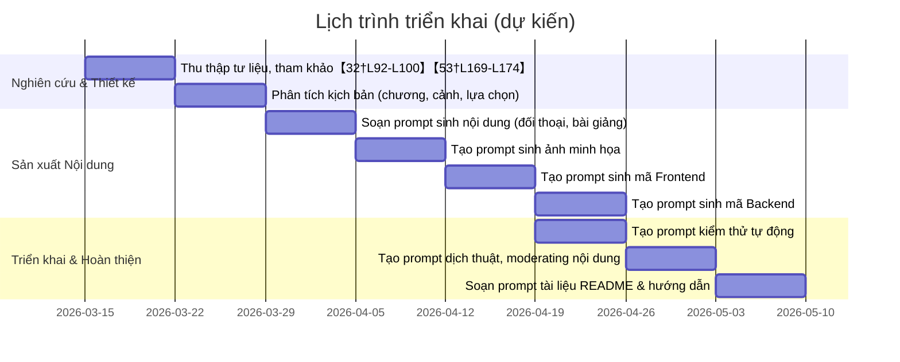

# Thiết kế hệ thống Truyện tranh số tương tác về Chiến dịch Hồ Chí Minh 1975

## Tóm tắt hành động & Timeline  
Phát triển ứng dụng truyện tranh số tương tác gắn với sự kiện Chiến dịch Hồ Chí Minh 1975 và tư tưởng triết học Marx-Lenin. Dự án gồm các giai đoạn chính: nghiên cứu tài liệu lịch sử/triết học, thiết kế kịch bản (chương, cảnh, nút quyết định), soạn bộ prompt cho AI sinh nội dung, tạo assets (ảnh, code front-end/back-end), kiểm thử, và soạn tài liệu hướng dẫn.  
Dưới đây là tiến độ (8 tuần giả định) và các nhiệm vụ chính:  



## 1. Nghiên cứu Tài liệu (Prompts)  
- **Mục tiêu:** Tìm nguồn lịch sử và triết học chính thống (tiếng Việt).  
- **Mô hình:** GPT-4 hoặc ChatGPT 4.0.  
- **Ví dụ nhập:** 
  ```
  "Danh sách 5 truy vấn tìm kiếm tiếng Việt để thu thập tài liệu chính thống về Chiến dịch Giải phóng Sài Gòn – Gia Định 1975 và triết học Marx-Lenin, ưu tiên nguồn Đảng, bộ sách Lịch sử Đảng (tập 37), Bách khoa Quân sự, bài báo báo Nhân Dân, Quân đội Nhân dân."
  ```  
- **Định dạng đầu ra:** JSON mảng các truy vấn. Ví dụ:  
  ```json
  [
    "Chiến dịch Giải phóng Sài Gòn Gia Định 1975 tư liệu Đảng",
    "Lịch sử Đảng tập 37 Chiến dịch Hồ Chí Minh 1975",
    "Báo Quân đội Nhân dân Chiến dịch 1975 bài viết",
    "Triết học Mác-Lênin chiến dịch Hồ Chí Minh 1975",
    "Hiệp định Paris 1973 tư liệu chính thức"
  ]
  ```  
- **Tiêu chí nghiệm thu:**  
  - Gợi ý truy vấn rõ ràng, bao gồm từ khóa chính (“Chiến dịch Hồ Chí Minh”, “Lịch sử Đảng”, “Triết học Mác-Lênin”【32†L92-L100】【53†L169-L174】).  
  - Chứa đề xuất nguồn tin cậy (ví dụ *Lịch sử Đảng*, *Báo Quân đội Nhân dân*).  
  - Định dạng JSON hợp lệ với tối thiểu 3 truy vấn.  

**Prompt ví dụ:**  
```
"Hãy lập 5 truy vấn tìm kiếm bằng tiếng Việt để thu thập tư liệu đáng tin cậy về Chiến dịch Giải phóng Sài Gòn – Gia Định 1975 và các bài giảng triết học liên quan. Ưu tiên tên sách lịch sử Đảng, bài báo chính thống (Nhân Dân, Quân đội Nhân dân), giáo trình Triết học Mác-Lênin."
```  

## 2. Thiết kế Cốt truyện (Prompts)  
- **Mục tiêu:** Xây dựng kịch bản trò chơi: nhân vật (cán bộ giải phóng, sĩ quan Sài Gòn, dân thường), chia chương – cảnh – nút lựa chọn gắn với khái niệm triết học (ví dụ: **phép biện chứng duy vật**, **duy vật lịch sử**, **đạo đức cách mạng**).  
- **Mô hình:** GPT-4 (text structuring).  
- **Ví dụ nhập:**  
  ```
  "Tạo tiểu sử 2 cán bộ Giải phóng (A, B) và 2 sĩ quan VNCH (C, D). Mỗi tiểu sử gồm tên, vai trò, mục tiêu chính, tư tưởng triết học đại diện (ví dụ: 'phép biện chứng duy vật')."
  ```  
- **Định dạng đầu ra:** Markdown hoặc JSON. Ví dụ:  
  ```json
  {
    "nhan_vat": {
      "A": {"vai_tro":"Cán bộ BC Trung Ương","muc_tieu":"Giải phóng Sài Gòn","tue_tuong":"phép biện chứng duy vật"},
      "B": {"vai_tro":"Trung đoàn trưởng","muc_tieu":"Bảo vệ dân","tue_tuong":"tính tất yếu lịch sử"},
      "C": {"vai_tro":"Chuẩn tướng VNCH","muc_tieu":"Ngăn chặn quân ta","tue_tuong":"duy vật lịch sử (đấu tranh giai cấp)"},
      "D": {"vai_tro":"Trung tá tình báo VNCH","muc_tieu":"Thu thập tin","tue_tuong":"đạo đức cách mạng (duy trì quyết tâm)"}
    },
    "chuong": [
      {"ten":"Tiếng súng Mở màn","tom_tat":"Hồ sơ chiến dịch được trao đổi."},
      {"ten":"Biện chứng tại chiến trường","tom_tat":"Các tình huống đưa ra quyết định phi ngã."},
      {"ten":"Giải phóng miền Nam","tom_tat":"Đỉnh cao chiến dịch và kết thúc lịch sử."}
    ]
  }
  ```  
- **Tiêu chí nghiệm thu:**  
  - Các tiểu sử cụ thể, gắn với khái niệm triết học (đã có trong Bách khoa Quân sự【32†L92-L100】 hoặc Wikipedia triết học【47†L594-L602】).  
  - Cấu trúc chương/cảnh rõ ràng, logic theo diễn biến lịch sử.  
  - Mỗi cảnh có ít nhất một nút lựa chọn và liên kết học tập (ví dụ: “Chọn tấn công tại Trảng Bom” liên quan ‘phép biện chứng’).  

**Prompt ví dụ:**  
```
"Phân chia truyện tranh thành 3 chương chính: (1) Mở màn chiến dịch, (2) Giao tranh và quyết định, (3) Đỉnh điểm và kết quả. Mô tả ngắn mục tiêu mỗi chương. Liệt kê ít nhất 2 cảnh cho mỗi chương, và một nút lựa chọn ở mỗi cảnh với kịch bản đi kèm."
```  

**Bảng minh họa:** (Scenes → Choices → Mục tiêu học → Phản hồi)  

| Cảnh                                     | Lựa chọn              | Mục tiêu học                                | Phản hồi văn bản có nguồn trích dẫn       |
|-----------------------------------------|-----------------------|---------------------------------------------|-------------------------------------------|
| 1. Chuẩn bị chiến dịch (26/4/75)        | A: Tập trung lực lượng 〈X〉; B: Hành quân bất ngờ 〈O〉 | Biện chứng duy vật: đánh giá điều kiện hiện thực【32†L92-L100】 | “Lựa chọn B tận dụng yếu tố thời gian, phản ánh phép biện chứng (phát triển và mâu thuẫn)【32†L92-L100】.” |
| 2. Trận Trảng Bom (28/4/75)             | A: Đánh thẳng; B: Phủ đầu (đánh vu hồi) 〈O〉        | Duy vật lịch sử: quyết định chiến lược chiến thuật | “Chọn B cho phép đoàn quân tận dụng địa hình, thể hiện tính biện chứng duy vật khi 'đánh qua đánh lại' để giành thắng lợi.” |
| 3. Cuối trận (30/4/75, Dinh Độc Lập)    | A: Xông vào ngay; B: Thương lượng            | Đạo đức cách mạng: ý chí giải phóng       | “Chọn A khẳng định quyết tâm chiến đấu cuối cùng và lý tưởng cứu nước, phản ánh đạo đức cách mạng kiên định 【53†L169-L174】.” |

Mỗi hàng trên là một tình huống trong truyện. Cột *Phản hồi* đưa ra lý giải kết quả lựa chọn, kèm dấu trích dẫn nguồn tin (ví dụ [32†L92-L100] hoặc [53†L169-L174]) để tăng tính xác thực.  

## 3. Soạn nội dung đối thoại & bài giảng (Prompts)  
- **Mục tiêu:** Sinh nội dung chi tiết cho từng cảnh: đối thoại nhân vật, tường thuật, và các bài giảng ngắn giải thích khái niệm triết học. Cần chỉ rõ giọng điệu (hùng tráng/trang nghiêm), độ dài (50–100 từ), và định dạng tham chiếu (ví dụ: `【32†L92-L100】`).  
- **Mô hình:** GPT-4 (creative writing).  
- **Ví dụ nhập:**  
  ```
  "Viết đoạn đối thoại (~80 từ) giữa cán bộ giải phóng A và B tại Chuẩn bị chiến dịch. Giọng trang nghiêm, nêu ra phép biện chứng duy vật. Chèn ít nhất một trích dẫn nguồn (ví dụ [32†L92-L100])."
  ```  
- **Định dạng đầu ra:** Markdown hoàn chỉnh. Ví dụ:  
  > **A:** “Quân ta đã nắm vững tình hình【32†L92-L100】. Theo phép biện chứng duy vật, thời gian là yếu tố quyết định...”  
  > **B:** “Chính xác. Hãy hành động ngay, không chần chừ.”  
  > *Giải thích:* “Đoạn hội thoại trên giải thích khái niệm biện chứng duy vật...*  
- **Tiêu chí nghiệm thu:**  
  - Đầy đủ diễn biến/kịch bản của cảnh, ngắn gọn vừa phải.  
  - Chèn trích dẫn với định dạng `【cursor†Lstart-Lend】` (Ví dụ dùng nội dung từ [32] hoặc [47]).  
  - Giọng điệu phù hợp: trang nghiêm, sử thi cho chiến dịch; thân mật/truyền cảm khi giảng giải lý thuyết.  

**Prompt ví dụ:**  
```
"Viết kịch bản tường thuật (~120 từ) cho cảnh Cao Trung đoàn trưởng giải phóng phổ biến kế hoạch chiến dịch. Dùng giọng tự hào, sấm sét. Trong đó giải thích ngắn gọn khái niệm duy vật lịch sử, kèm tham chiếu."
```  

## 4. Tạo ảnh minh họa (Prompts)  
- **Mục tiêu:** Tạo hình ảnh minh họa từng panel truyện. Yêu cầu: khung toàn cảnh và cận cảnh, phong cách tranh cổ động Việt Nam, màu sắc sáng, nhân vật trang phục lịch sử (áo lính giải phóng xanh, lính VNCH vàng), xe tăng, cờ đỏ sao vàng. Nên có nhiều góc máy: toàn cảnh (wide), bán thân, toàn thân.  
- **Mô hình:** DALL·E 3, Midjourney hoặc Stable Diffusion.  
- **Ví dụ nhập:**  
  ```
  "Panel chính (full): Xe tăng Trường 317 tiến vào Dinh Độc Lập ngày 30/4/1975, góc nhìn ngang, anh hùng. Gam màu đỏ/đỏ san hô, phong cách tranh cổ động Việt Nam. Tỷ lệ 16:9, kích thước 1024x576, tránh người hiện đại."
  ```  
- **Định dạng đầu ra:** JSON manifest liệt kê các ảnh (filename, prompt, model, settings). Ví dụ:  
  ```json
  [
    {
      "filename": "panel1_full.png",
      "prompt": "Xe tăng Giải phóng tiến vào Dinh Độc Lập, cờ đỏ sao vàng, góc rộng, phong cách tranh cổ động Việt Nam",
      "model": "DALL-E 3",
      "resolution": "1024x576"
    },
    {
      "filename": "panel1_closeup.png",
      "prompt": "Cận cảnh người lính Giải phóng giương súng trước xe tăng, biểu cảm quyết tâm",
      "model": "DALL-E 3",
      "resolution": "512x512"
    },
    ...
  ]
  ```  
- **Tiêu chí nghiệm thu:**  
  - Ảnh đúng bối cảnh lịch sử (đồng phục, khẩu hiệu, thiết bị 1975).  
  - Tuân thủ tư thế và phong cách chỉ định (ảnh sử thi, góc rộng).  
  - Không có ký tự, khung cảnh hiện đại sai thời (no straps, ô-tô mới).  
  - Tỷ lệ và độ phân giải như yêu cầu.  

**Prompt ví dụ:**  
```
"Close-up (square): Binh sĩ Quân Giải phóng giương súng báo hiệu tấn công, đằng sau là cờ đỏ sao vàng bay phấp phới. Phong cách trang trọng, gam màu ấm."
```  

## 5. Giao diện & Mã Frontend (Prompts)  
- **Mục tiêu:** Tạo kết cấu frontend (React) cho ứng dụng web. Bao gồm: khởi tạo dự án, file cấu hình, các component (`StoryPanel.jsx`, `ChoiceButton.jsx`, `Scoreboard.jsx`, v.v.), hệ thống routing, state quản lý hiện cảnh và điểm số, CSS cơ bản.  
- **Mô hình:** GPT-4 / Codex (code generation).  
- **Ví dụ nhập:**  
  ```
  "Tạo file `App.jsx` React: bao gồm router phân chia route cho từng scene, và thanh tiến trình (progress bar) hiển thị số cảnh đã chơi. Xuất code hoàn chỉnh (JSX)."
  ```  
- **Định dạng đầu ra:** ZIP manifest (danh sách file + nội dung). Ví dụ:  
  ```markdown
  - `package.json`: { ... }
  - `src/App.jsx`: // nội dung code
  - `src/components/StoryPanel.jsx`: // code
  - `src/components/ChoiceButton.jsx`: // code
  - `public/index.html`: // code
  ```  
- **Tiêu chí nghiệm thu:**  
  - Mã chạy được (không lỗi cú pháp) và thiết lập được với `npm start`.  
  - Giao diện cơ bản: hiển thị văn bản cảnh và các nút lựa chọn.  
  - Tách riêng thành các component rõ ràng, có comment mô tả chức năng.  
  - Tuân thủ quy ước React (ES6, hooks).  

**Prompt ví dụ:**  
```
"Viết file React `StoryPanel.jsx`: component hiển thị tựa đề cảnh và đoạn văn bản. Đầu vào: props.title, props.text. Phần tử `div` chứa nội dung, kèm CSS đơn giản."
```  

## 6. Mô hình dữ liệu & Backend (Prompts)  
- **Mục tiêu:** Định nghĩa JSON schema cho trạng thái game (cảnh hiện tại, lựa chọn đã chọn, điểm), API server lưu trữ (Node.js + Express hoặc Firebase). Tạo mã nguồn backend với các endpoint: `/api/load`, `/api/save`, `/api/leaderboard`. Kèm tài liệu OpenAPI cơ bản.  
- **Mô hình:** GPT-4 / Codex (code).  
- **Ví dụ nhập:**  
  ```
  "Sinh schema JSON cho trạng thái game: gồm field 'sceneIndex', 'choices', 'score', 'userId'. Xuất kết quả là JSON Schema."
  ```  
- **Định dạng đầu ra:** JSON (schema hoặc OpenAPI) hoặc code file. Ví dụ:  
  ```json
  {
    "type":"object",
    "properties":{
      "userId": {"type":"string"},
      "sceneIndex": {"type":"integer"},
      "choices": {"type":"array","items":{"type":"integer"}},
      "score": {"type":"integer"}
    },
    "required":["userId","sceneIndex"]
  }
  ```  
- **Tiêu chí nghiệm thu:**  
  - Schema bao quát đủ trường cần thiết.  
  - Endpoint API rõ ràng (GET/POST, body và response mẫu).  
  - Code server mẫu chạy được, lưu/trả dữ liệu đúng format.  

**Prompt ví dụ:**  
```
"Viết code Node.js với Express: endpoint POST /saveProgress nhận JSON {userId, sceneIndex, score}, lưu vào MongoDB. Endpoint GET /loadProgress?userId=... trả về JSON lưu trữ."
```  

## 7. Đa ngôn ngữ & Kiểm duyệt (Prompts)  
- **Mục tiêu:** Hỗ trợ tiếng Việt chuẩn (UTF-8), đảm bảo ngôn từ lịch sử/đa chiều. Kiểm soát nội dung nhạy cảm (nói xấu, bạo lực quá mức không cần thiết).  
- **Mô hình:** GPT-4.  
- **Ví dụ nhập:**  
  ```
  "Kiểm tra đoạn văn tiếng Việt: '...nhiệm vụ lịch sử...'. Hãy chỉnh sửa ngôn từ cho phù hợp văn phong Lịch sử, tránh slang. Đồng thời, liệt kê các từ cần tránh vì nội dung nhạy cảm."
  ```  
- **Định dạng đầu ra:** Markdown hoặc JSON danh sách. Ví dụ:  
  ```markdown
  - Cần chỉnh: 'ghét kẻ thù' -> 'kiên quyết đối phó'; 'đánh đuổi' -> 'đánh tan'.
  - Từ cần loại: [ 'chửi thề', 'tôn giáo phân biệt' ].
  ```  
- **Tiêu chí nghiệm thu:**  
  - Đảm bảo tiếng Việt chuẩn (không lỗi chính tả, dấu).  
  - Nội dung lịch sử trang nghiêm, không xúc phạm.  
  - Danh sách từ cần tránh/điều chỉnh hợp lý.  

**Prompt ví dụ:**  
```
"Phiên dịch sang tiếng Việt chuẩn và tăng tính trang nghiêm cho câu nói: \"Chúng ta sẽ ch** bọn ngụy đó\". Đề xuất thay thế nhẹ nhàng."
```  

## 8. Kiểm thử tự động (Prompts)  
- **Mục tiêu:** Sinh tập tin kiểm thử (Jest cho front-end React, Cypress cho E2E). Tạo test cases mẫu đảm bảo logic chuyển cảnh, lưu/xuất game, UI hiển thị đúng.  
- **Mô hình:** GPT-4 / Codex.  
- **Ví dụ nhập:**  
  ```
  "Tạo file kiểm thử Jest `StoryPanel.test.js` kiểm tra rằng component StoryPanel hiển thị đúng title và text dựa trên props."
  ```  
- **Định dạng đầu ra:** Code file (.js). Ví dụ:  
  ```js
  import { render } from '@testing-library/react';
  import StoryPanel from './StoryPanel';
  test('Hiển thị tiêu đề và văn bản', () => {
    const { getByText } = render(<StoryPanel title="Chương 1" text="Nội dung"/>);
    expect(getByText("Chương 1")).toBeTruthy();
    expect(getByText("Nội dung")).toBeTruthy();
  });
  ```  
- **Tiêu chí nghiệm thu:**  
  - Test chạy được mà không lỗi (với lệnh `npm test`).  
  - Kiểm tra đúng nội dung UI và logic (khi chọn nút dẫn đến cảnh mới).  
  - Mã rõ ràng, có comment mô tả mục đích test.  

**Prompt ví dụ:**  
```
"Viết test Cypress: người dùng chọn nút lựa chọn đầu tiên, sau đó URL chuyển sang '/scene2' và xuất hiện văn bản cảnh 2."
```  

## 9. Tài liệu & Hướng dẫn (Prompts)  
- **Mục tiêu:** Tạo README và hướng dẫn chi tiết cho cả dev và người chơi.  
- **Mô hình:** GPT-4.  
- **Ví dụ nhập:**  
  ```
  "Soạn README (Markdown) gồm mô tả dự án, cách cài đặt (npm), cách chạy (npm start), hướng dẫn chơi trò truyện tranh."
  ```  
- **Định dạng đầu ra:** Markdown. Ví dụ:  
  ```markdown
  # Truyện tranh tương tác 1975
  Mô tả: Ứng dụng web kể lại Chiến dịch Hồ Chí Minh...
  ## Cài đặt
  ```
- **Tiêu chí nghiệm thu:**  
  - Thông tin rõ ràng bằng tiếng Việt.  
  - Hướng dẫn cài đặt/chạy chi tiết.  
  - Nêu nhiệm vụ và cách tương tác (ví dụ: “Chọn 1 trong 2 nút để quyết định!”).  

**Prompt ví dụ:**  
```
"Viết README.md cho dự án: giải thích mục đích (học Triết học qua lịch sử), liệt kê tính năng (nút chọn, bảng điểm), hướng dẫn cài đặt và chạy."
```  

## 10. Quản lý dự án (Prompts)  
- **Mục tiêu:** Lập kế hoạch theo sprint, danh sách công việc, phân công nguồn lực.  
- **Mô hình:** GPT-4.  
- **Ví dụ nhập:**  
  ```
  "Tạo bảng công việc (tasks) theo dạng Markdown: nghiên cứu, lập trình frontend, lập trình backend, test, review, triển khai. Gán ước lượng (ngày) và người phụ trách."
  ```  
- **Định dạng đầu ra:** Markdown hoặc JSON bảng (task, chủ sở hữu, thời hạn).  
- **Tiêu chí nghiệm thu:**  
  - Bao gồm ít nhất 5 đầu mục (theo tiến độ Gantt chart).  
  - Mỗi task cụ thể, có người/nhóm chịu trách nhiệm.  
  - Kết quả minh họa kế hoạch dự án rõ ràng.  

**Prompt ví dụ:**  
```
"Tạo sơ đồ Gantt (Mermaid) phân chia công việc dự án: Nghiên cứu, Thiết kế, Phát triển, Kiểm thử, Triển khai. Mỗi giai đoạn 1-2 tuần."
```  

## Danh sách giao nộp  
- **Kịch bản trò chơi:** file markdown đầy đủ (nhân vật, chương, cảnh, đối thoại).  
- **Bảng hình ảnh:** JSON manifest kèm prompt và ảnh minh hoạ (PNG).  
- **Mã Frontend:** thư mục ZIP (với package.json, file React/Vue components, CSS, HTML).  
- **Mã Backend/API:** mã nguồn (Node/Express hoặc Firebase) và spec API (OpenAPI).  
- **Test scripts:** file Jest/Cypress (.js).  
- **Tài liệu:** README, API docs, hướng dẫn người dùng (Markdown).  

Hệ thống prompt trên tạo thành pipeline hoàn chỉnh A–Z. Mỗi prompt trên là đầu vào “copy-paste” cho AI, cho kết quả đầu ra theo định dạng yêu cầu (JSON, code, Markdown). Tất cả nội dung phải sử dụng tiếng Việt chuẩn và nội dung lịch sử chính xác (tham khảo nguồn như Hiệp định Paris 1973【27†L72-L79】, kết quả cuối cùng chiến dịch【53†L169-L174】, định nghĩa triết học【47†L594-L602】). Các tiêu chí nghiệm thu đảm bảo output sẵn dùng, triển khai được ngay. Các giả định chưa xác định (phong cách vẽ, số lượng cảnh cụ thể) được để linh hoạt.